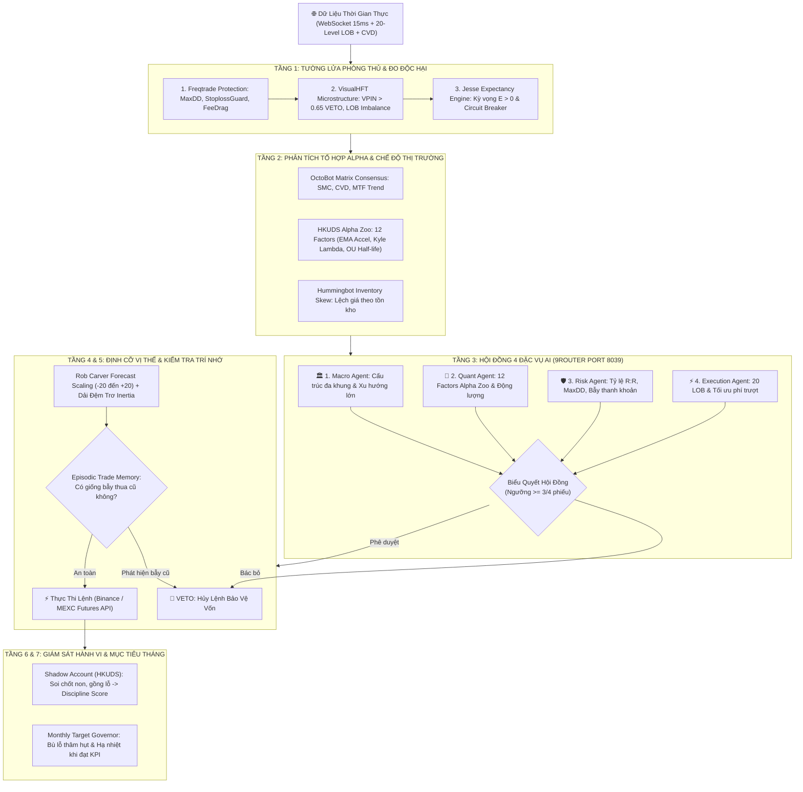

# 🚀 Binance & MEXC Futures AI Quant Trading Desk (USDⓈ-M)
### *Hệ Thống Giao Dịch Định Lượng Đa Tầng Hợp Nhất AI Swarm Council, Vi Mô Sổ Lệnh HFT & Quản Trị Danh Mục Tinh Hoa*

[](https://www.python.org/)
[](https://fastapi.tiangolo.com/)
[](https://github.com/9router)
[](LICENSE)
[]()

---

## 📖 Mục Lục
1. [Giới Thiệu Tổng Quan](#-giới-thiệu-tổng-quan)
2. [Các Công Trình Nghiên Cứu & Repositories Được Tích Hợp](#-các-công-trình-nghiên-cứu--repositories-được-tích-hợp)
3. [Kiến Trúc Phối Hợp Đa Tầng (Synergy Pipeline 7 Giai Đoạn)](#-kiến-trúc-phối-hợp-đa-tầng-synergy-pipeline-7-giai-đoạn)
4. [Các Tính Năng Định Lượng Đột Phá](#-các-tính-năng-định-lượng-đột-phá)
5. [Cài Đặt & Khởi Động Nhanh (Quick Start)](#-cài-đặt--khởi-động-nhanh-quick-start)
6. [Hướng Dẫn Sử Dụng Web Trading Desk](#-hướng-dẫn-sử-dụng-web-trading-desk)
7. [Cấu Trúc Mã Nguồn (Project Tree)](#-cấu-trúc-mã-nguồn-project-tree)
8. [Kiểm Thử Đơn Vị (Unit Testing)](#-kiểm-thử-đơn-vị-unit-testing)
9. [Cơ Chế Bảo Mật & Lưu Trữ Dữ Liệu (Zero Data Loss)](#-cơ-chế-bảo-mật--lưu-trữ-dữ-liệu-zero-data-loss)
10. [Tuyên Bố Rủi Ro (Disclaimer)](#-tuyên-bố-rủi-ro-disclaimer)

---

## 🌟 Giới Thiệu Tổng Quan

**Binance & MEXC Futures AI Quant Trading Desk** là một nền tảng giao dịch thuật toán phái sinh chuyên nghiệp (USDⓈ-M Futures), được phát triển nhằm giải quyết triệt để các hạn chế của những bot giao dịch thế hệ cũ:
- **Không phụ thuộc vào chỉ báo chậm**: Tích hợp trực tiếp dữ liệu vi mô luồng lệnh (Order Flow CVD), xác suất dòng tiền độc hại (VPIN) và độ mất cân bằng 20 tầng sổ lệnh (LOB Imbalance).
- **Hội đồng 4 Đặc Vụ AI Phản Biện (Swarm Council)**: Đấu nối trực tiếp qua cổng nội bộ **9Router (Port 8039)**, cho phép kết hợp sức mạnh nhận thức của Google Gemini, Anthropic Claude, DeepSeek Reasoner trước khi giải ngân vốn.
- **Quản trị rủi ro cấp quỹ đầu cơ (Hedge-fund Grade Risk Overlay)**: Áp dụng dải đệm trơ (Inertia Buffer) và mục tiêu biến động tiền mặt (Cash Volatility Target) của chuyên gia định lượng **Rob Carver** (*pysystemtrade*).
- **Tài khoản bóng ma (Shadow Account)**: Soi xét 3 lỗi tâm lý kinh điển của trader (Chốt non, Gồng lỗ, Đánh trả thù) và chấm điểm kỷ luật giao dịch (*Discipline Score*).
- **Bảo toàn dữ liệu tuyệt đối (Zero Data Loss)**: Toàn bộ số dư, vị thế mở, lịch sử lệnh, bài học kinh nghiệm AI, và cấu hình mô hình đều được ghi nhận vĩnh viễn vào SQLite (`bot_database.db`).

---

## 🔬 Các Công Trình Nghiên Cứu & Repositories Được Tích Hợp

Hệ thống được thiết kế bằng cách chắt lọc những tinh hoa học thuật và mã nguồn mở hàng đầu thế giới về định lượng tài chính:

| STT | Tên Repository / Tác Giả | Tinh Hoa Được Trích Xuất & Tích Hợp | Vai Trò Trong Kiến Trúc Bot |
| :--- | :--- | :--- | :--- |
| **1** | [HKUDS/Vibe-Trading](https://github.com/HKUDS/Vibe-Trading)<br>*(ĐH Hồng Kông - Data Intelligence Lab)* | • **Alpha Zoo Engine**: 12 Factors toán học đỉnh cao (Gia tốc sóng EMA, Kyle's Lambda đo tác động giá, Amihud Illiquidity, Yang-Zhang Volatility, Ornstein-Uhlenbeck Half-Life).<br>• **Swarm Council**: Hội đồng 4 đặc vụ AI độc lập (Macro, Quant, Risk, Exec) phản biện qua cổng 9Router.<br>• **Shadow Account**: Soi 3 lỗi tâm lý (Chốt non, gồng lỗ, trả thù) và tính Discipline Score. | **Cổng Duyệt Lệnh Tối Cao 1.11 & Soi Xét Tâm Lý**: Hội đồng AI biểu quyết đa số trước khi mở lệnh; giám sát hành vi sau khi chốt lệnh. |
| **2** | [visualHFT/VisualHFT](https://github.com/visualHFT/VisualHFT)<br>*(C#/.NET High-Frequency Trading Engine)* | • **VPIN (Volume-Synchronized Probability of Toxicity)**: Đo tỷ lệ độc hại dòng tiền cá mập.<br>• **20-Level LOB Imbalance**: Trọng số decay đo lực đè sổ lệnh.<br>• **Market Resilience**: Đo tốc độ hồi phục thanh khoản sau cú quét thanh lý.<br>• **Spoofing Detection**: Phát hiện đặt/hủy lệnh ảo OTT. | **Cổng Vi Mô 1.5 & Bộ Lọc Độc Hại**: VETO lệnh lập tức nếu VPIN > 0.65 (cá mập xả ngầm) hoặc thanh khoản cạn kiệt. |
| **3** | [Rob Carver / pysystemtrade](https://github.com/robcarver17/pysystemtrade)<br>*(Tác giả Systematic Trading / Cựu AHL)* | • **Forecast Scaling & Capping**: Chuẩn hóa tín hiệu đa chiến lược từ -20 đến +20.<br>• **Daily Cash Volatility Target**: Cố định rủi ro biến động danh mục hàng ngày.<br>• **Inertia Buffer Bands**: Dải đệm trơ ngăn chặn tái cân bằng vụn vặt, tiết kiệm phí sàn.<br>• **Risk Overlay**: Giảm size vị thế khi gặp Vol Shock hoặc Drawdown. | **Cổng Định Cỡ 1.8 & Tối Ưu Phí Sàn**: Quyết định chính xác số lượng hợp đồng (Contract Size) vào lệnh, loại bỏ lệnh rác gây tốn phí maker/taker. |
| **4** | [jesse-ai/jesse](https://github.com/jesse-ai/jesse)<br>*(Nền tảng giao dịch tiền mã hóa nâng cao)* | • **Mathematical Expectancy Engine**: Kỳ vọng toán học $E = (W \times AW) - (L \times AL)$.<br>• **Consecutive Loss Circuit Breaker**: Tạm dừng bot khi thua 3 lệnh liên tiếp và kỳ vọng âm.<br>• **Kelly Fractional Capital Multiplier**. | **Cổng Bảo Vệ Vốn 1.7**: Chỉ cho phép mở vị thế khi chiến lược có lợi thế thống kê dương (*Edge*). |
| **5** | [OctoBot-Project/OctoBot](https://github.com/OctoBot-Project/OctoBot)<br>*(Nền tảng giao dịch đa xúc tu)* | • **OctoBot Matrix Consensus**: Phân tích đa xúc tu kết hợp SMC, CVD, MTF.<br>• **Adaptive Trading Modes**: Điều phối linh hoạt giữa Scalping, DayTrading, Swing và Grid. | **Cổng Nhận Diện Chế Độ 1.6**: Xác định tính khả thi giao dịch (*Tradability*) và chọn kiểu đánh phù hợp với bối cảnh thị trường. |
| **6** | [freqtrade/freqtrade](https://github.com/freqtrade/freqtrade)<br>*(Bot giao dịch định lượng hàng đầu)* | • **StoplossGuard & MaxDrawdownGuard**.<br>• **Cooldown Protection** (Thời gian hạ nhiệt sau chuỗi lệnh thua).<br>• **FeeDrag Guard**: Chặn lệnh nếu biên lãi tiềm năng không đủ bù trượt giá và phí sàn VIP. | **Cổng Phòng Thủ 1.0**: Tường lửa tầng đầu tiên ngăn cháy tài khoản trước khi phân tích sâu. |
| **7** | [hummingbot/hummingbot](https://github.com/hummingbot/hummingbot)<br>*(HFT Market Making)* | • **Avellaneda-Stoikov Inventory Skew**.<br>• **Reservation Price Offset**: Điều chỉnh giá đặt mua/bán theo độ lệch số dư vị thế đang nắm giữ. | **Cân Bằng Danh Mục**: Tránh dồn quá nhiều vị thế một chiều khi giá chạy mạnh 1 hướng. |
| **8** | [LLM_trader](https://github.com/FinNLP/TradingAgents)<br>*(FinNLP / Episodic Memory Reasoning)* | • **Episodic Trade Memory Bank**: Ghi nhận bối cảnh (RSI, CVD, SMC, VWAP) các lệnh thua.<br>• **Deterministic Guardrail**: Quét tương đồng (Cosine Similarity) để chặn bot lặp lại cùng một sai lầm trong quá khứ. | **Cổng Trí Nhớ 1.9**: Đảm bảo bot học hỏi từ dữ liệu SQLite, không lặp lại sai lầm cũ. |
| **9** | [9Router AI Gateway](https://github.com/9router)<br>*(Multi-LLM Unified Gateway Port 8039)* | • **Multi-LLM Unified Gateway**: Đấu nối đồng thời Google Gemini, Anthropic Claude, DeepSeek qua 1 cổng OpenAI-compatible nội bộ. | **Hạ Tầng Nhận Thức Sâu**: Cung cấp năng lực suy luận Chain-of-Thought trực tiếp cho cả AI Copilot và Hội đồng 4 Đặc vụ. |

---

## 📐 Kiến Trúc Phối Hợp Đa Tầng (Synergy Pipeline 7 Giai Đoạn)

Quy trình phê duyệt và thực thi một lệnh giao dịch trải qua 7 tầng kiểm duyệt nghiêm ngặt:



---

## ⚡ Các Tính Năng Định Lượng Đột Phá

### 1. Hội Đồng 4 Đặc Vụ AI Độc Lập (Swarm Council)
- **Macro Agent**: Đánh giá bối cảnh nến ngày (1D/4H), chu kỳ sóng thị trường.
- **Quant Agent**: Kiểm tra gia tốc nến và tính chu kỳ hoàn vốn Ornstein-Uhlenbeck.
- **Risk Agent**: Kiểm soát khoảng cách Stop Loss, đòn bẩy và tỷ lệ Risk/Reward.
- **Execution Agent**: Kiểm tra sổ lệnh 20 tầng LOB để tránh trượt giá và bẫy cá mập.
- **Ngưỡng biểu quyết linh hoạt**: Người dùng có thể chọn >= 3/4 (Đa số áp đảo) hoặc 4/4 (Đồng thuận 100%).

### 2. Bộ Lọc Vi Mô Sổ Lệnh HFT (VisualHFT)
- **VPIN (Volume-Synchronized Probability of Toxicity)**: Bóc trần dòng tiền xả ngầm của Market Maker trước khi giá sập.
- **20-Level Weighted LOB Imbalance**: Tính toán chênh lệch lực mua/bán với trọng số phân rã 1/sqrt(k).
- **Market Resilience**: Đo tốc độ phục hồi thanh khoản trong 10-30 giây sau các cú râu nến quét thanh lý.

### 3. Tối Ưu Hóa Kích Thước Vị Thế Rob Carver (pysystemtrade)
- Không dùng fixed-lot hay martingale nguy hiểm.
- Áp dụng **Cash Volatility Targeting**: Tính toán chính xác số lượng coin cần mở dựa trên độ biến động ATR và số dư tài khoản.
- **Inertia Buffer Bands**: Chỉ điều chỉnh vị thế khi độ lệch vượt ra ngoài biên đệm, giúp loại bỏ các lệnh nhỏ lẻ tốn phí sàn.

### 4. Tài Khoản Bóng Ma (Shadow Account) & Chấm Điểm Kỷ Luật
- So sánh lệnh thực tế của người dùng/bot với kịch bản tối ưu.
- Bóc tách 3 lỗi tâm lý: Chốt non (*Premature Exit*), Gồng lỗ (*Loss Aversion*), Đánh trả thù (*Revenge Trading*).
- Chấm điểm kỷ luật **Discipline Score (0 - 100%)** và tính toán lượng lợi nhuận bị bỏ lỡ (*Missed Alpha*).

### 5. Thống Đốc Mục Tiêu Lợi Nhuận Tháng (Monthly Target Governor)
- Đặt KPI lợi nhuận hàng tháng (ví dụ: 10% - 20%/tháng).
- Tự động ghi nhận thâm hụt của tháng trước để bù lỗ thông minh vào tháng tiếp theo.
- Khi đã hoàn thành mục tiêu tháng, bot tự động kích hoạt chế độ **Bảo Vệ Thành Quả (Capital Preservation)**, hạ quy mô giao dịch về mức an toàn tối thiểu.

### 6. Hỗ Trợ Đa Sàn Giao Dịch
- **Binance Futures (USDⓈ-M)**: Mainnet & Testnet qua HMAC-SHA256.
- **MEXC Futures (Contract API)**: Hỗ trợ Base URL chuyên dụng và Proxy URL để vượt tường lửa địa lý.

---

## 🛠️ Cài Đặt & Khởi Động Nhanh (Quick Start)

### Yêu Cầu Môi Trường
- **Hệ Điều Hành**: Windows 10/11, macOS, hoặc Linux (Ubuntu 20.04+).
- **Python**: Phiên bản `3.10` trở lên.
- **Node.js**: Phiên bản `18.x` trở lên (để chạy 9Router Gateway).

---

### Bước 1: Clone Repository
```bash
git clone https://github.com/tathanhan-ai/Bot-Tradding-AI.git
cd Bot-Tradding-AI
```

### Bước 2: Cài Đặt Phụ Thuộc (1-Click Installer)
Hệ thống cung cấp script cài đặt tự động toàn diện:

- **Trên Windows**:
  ```cmd
  install_skills.bat
  ```
- **Trên Linux / macOS**:
  ```bash
  chmod +x install_skills.sh run_bot.sh
  ./install_skills.sh
  ```

*Script trên sẽ tự động cài đặt các thư viện Python cần thiết (`fastapi`, `uvicorn`, `pandas`, `websockets`, v.v.) và nạp gói `9router` vào thư mục `gateway_9router`.*

---

### Bước 3: Khởi Động Hệ Thống (1-Click Runner)

- **Trên Windows**:
  ```cmd
  run_bot.bat
  ```
- **Trên Linux / macOS**:
  ```bash
  ./run_bot.sh
  ```

Script sẽ đồng thời khởi động:
1. **9Router AI Gateway**: Chạy tại `http://127.0.0.1:8039` (kết nối 28 models).
2. **Trading Desk Server**: Chạy tại `http://127.0.0.1:8000`.

Truy cập ngay bảng điều khiển tại: **[http://localhost:8000](http://localhost:8000)**

---

## 🖥️ Hướng Dẫn Sử Dụng Web Trading Desk

### 1. Modular Intelligence HUD (Thanh Thông Tin Định Lượng Đa Tầng)
- **Tab 1: 📡 Radar Thị Trường**: Tổng hợp tín hiệu RSI, ATR, VWAP, khối lượng và dòng tiền đa khung thời gian.
- **Tab 2: 🧠 AI Brain**: Dự báo xác suất bứt phá và đánh giá chế độ thị trường (Regime).
- **Tab 3: ⚖️ Ensemble Strategy**: Điểm số đồng thuận của 5 chiến lược cốt lõi.
- **Tab 4: 🛡️ Risk & Leverage**: Đòn bẩy động (Dynamic Leverage 2x - 10x) và cảnh báo khoảng cách thanh lý.
- **Tab 5: 🤖 AI Model Copilot (9Router)**:
  - Chọn model trực tiếp (`ag/gemini-3.8-flash-high`, `ag/claude-sonnet-4-6`, `ds/deepseek-reasoner`, v.v.).
  - Theo dõi chuỗi suy luận sâu (Deep Chain-of-Thought) và cảnh báo bẫy cá mập.
  - Nhập chỉ thị ngôn ngữ tự nhiên (Natural Language Steering) cho AI.
  - **Tự động lưu trạng thái vào SQLite**.
- **Tab 6: 🔬 VisualHFT & Sổ Lệnh LOB**: Biểu đồ 20 tầng orderbook, chỉ số VPIN và tốc độ hồi phục thanh khoản.
- **Tab 7: 👑 Vibe Swarm & Alpha Zoo (HKUDS)**: Trực quan hóa lá phiếu của 4 đặc vụ, 12 Alpha factors toán học và bảng soi lỗi tâm lý Shadow Account.

### 2. Bảng Cài Đặt Hệ Thống (Settings Modal)
Bấm nút **[⚙️ CÀI ĐẶT HỆ THỐNG]** trên thanh Header:
- **Tab 1: Khóa API & Chế Độ**: Nhập Binance API Key / Secret hoặc MEXC API Key, chuyển đổi Demo / Live.
- **Tab 2: Thống Đốc Mục Tiêu Tháng**: Thiết lập % KPI tháng, bật/tắt cơ chế bù lỗ thâm hụt.
- **Tab 3: Cấu Hình Phí VIP**: Cấu hình phí Maker/Taker theo phân hạng VIP 0 - VIP 9 hoặc tỷ lệ tùy chỉnh.
- **Tab 4: Sao Lưu & Khôi Phục**: Kiểm tra cơ sở dữ liệu SQLite, xuất dữ liệu JSON hoặc đặt lại số dư.
- **Tab 5: Chuyển Đổi Sàn**: Chọn sàn hoạt động chính (Binance Futures hoặc MEXC Contract).
- **Tab 6: Vibe AI Swarm (9Router)**:
  - Bật / Tắt Hội đồng 4 đặc vụ.
  - Chọn ngưỡng biểu quyết (>= 3/4 hoặc 4/4).
  - Nút **`[🔄 Lấy Model Từ 9Router]`**: Nạp ngay danh sách 28 models trực tiếp từ cổng 8039.
  - Chọn model độc lập cho Macro, Quant, Risk, Execution Agent.
  - Nút **`[⚡ Tranh Luận Thử Ngay]`**: Kiểm tra lập luận của 4 đặc vụ theo dữ liệu thị trường tức thời.

---

## 📁 Cấu Trúc Mã Nguồn (Project Tree)

```text
Bot-Tradding-AI/
├── config/
│   └── settings.py                 # Cấu hình tham số chiến lược, đòn bẩy, tỷ lệ rủi ro mặc định
├── data/
│   ├── binance_api_manager.py      # Module ký số HMAC-SHA256 giao dịch Live Binance Futures
│   ├── mexc_api_manager.py         # Module giao dịch Live MEXC Contract (Futures) qua Proxy
│   ├── binance_ws_stream.py        # Động cơ WebSocket sub-second thu thập Live Ticker & Klines
│   ├── fetcher.py                  # Thu thập nến lịch sử qua Binance Public REST API
│   └── persistent_storage.py       # Quản lý lưu trữ SQLite vĩnh viễn (Zero Data Loss)
├── gateway_9router/
│   ├── run_9router.js              # Script khởi động 9Router Gateway trên Port 8039
│   ├── package.json                # Khai báo gói npm 9router
│   ├── start_9router.bat           # File chạy 9Router cho Windows
│   └── start_9router.sh            # File chạy 9Router cho Linux/macOS
├── risk/
│   ├── dynamic_leverage.py         # Động cơ đòn bẩy thích ứng theo biến động thị trường
│   ├── fee_and_spread_engine.py    # Mô phỏng phí Maker/Taker VIP 0-9 & trượt giá Bid-Ask
│   ├── freqtrade_protections.py    # Khung phòng thủ StoplossGuard, MaxDrawdown, Cooldown
│   ├── jesse_expectancy_engine.py  # Động cơ kỳ vọng toán học & Kelly Criterion (Jesse AI)
│   ├── monthly_target_governor.py  # Thống đốc mục tiêu lợi nhuận tháng & bù trừ thâm hụt
│   ├── order_manager.py            # Quản trị hàng đợi lệnh Limit, Stop, Trailing Stop
│   └── risk_manager.py             # Tính toán kích thước vị thế (Position Sizing) an toàn
├── strategy/
│   ├── ai_brain.py                 # Nhận diện chế độ thị trường (Trend / Ranging / Squeeze)
│   ├── ai_model_copilot.py         # Lớp nhận thức sâu AI Copilot qua 9Router Port 8039
│   ├── ai_position_manager.py      # Quản lý khóa lãi hòa vốn (Breakeven) & Dynamic TP/SL
│   ├── ensemble_strategy.py        # Bộ điều phối tổ hợp đa chiến lược (Ensemble Hub)
│   ├── grid_bot.py                 # Chiến lược Futures Grid lưới trung hòa biến động
│   ├── hummingbot_inventory_skew.py# Mô hình Avellaneda-Stoikov Inventory Skew
│   ├── memory_reasoning_engine.py  # Ngân hàng trí nhớ lệnh thua Episodic Trade Memory
│   ├── mtf_trend_atr.py            # Chiến lược cốt lõi MTF Trend + Donchian Breakout
│   ├── multi_candle_patterns.py    # Nhận diện mô hình nến đa khung thời gian
│   ├── octobot_matrix.py           # Phân tích đa xúc tu SMC + CVD + VWAP (OctoBot)
│   ├── octobot_trading_modes.py    # Điều phối chế độ giao dịch (Scalp/Day/Swing/Grid)
│   ├── order_flow_cvd.py           # Phân tích Delta khối lượng tích lũy (CVD)
│   ├── shadow_account.py           # Tài khoản bóng ma soi lỗi tâm lý trader (HKUDS)
│   ├── vibe_alpha_zoo.py           # Động cơ tính toán 12 Alpha factors (HKUDS)
│   ├── vibe_swarm_council.py       # Hội đồng 4 đặc vụ AI biểu quyết qua 9Router (HKUDS)
│   └── visual_hft_microstructure.py# Động cơ vi mô LOB Imbalance 20 tầng & VPIN (VisualHFT)
├── tests/
│   ├── test_vibe_trading.py        # Kiểm thử bộ ba HKUDS (Alpha Zoo, Swarm Council, Shadow Acc)
│   ├── test_visual_hft.py          # Kiểm thử vi mô sổ lệnh VisualHFT & VPIN
│   ├── test_carver_sizing.py       # Kiểm thử định cỡ vị thế & dải đệm Rob Carver
│   ├── test_freqtrade_engine.py    # Kiểm thử bộ lọc phòng thủ Freqtrade
│   └── test_octobot_engine.py      # Kiểm thử ma trận đồng thuận OctoBot
├── ui/
│   ├── server.py                   # FastAPI WebSocket Server chính (Port 8000)
│   └── templates/
│       └── index.html              # Giao diện Trading Desk tích hợp TradingView Charts
├── install_skills.bat              # Script cài đặt 1-Click cho Windows
├── install_skills.sh               # Script cài đặt 1-Click cho Linux/macOS
├── run_bot.bat                     # Script khởi động 1-Click cho Windows
├── run_bot.sh                      # Script khởi động 1-Click cho Linux/macOS
├── requirements.txt                # Danh sách thư viện Python
└── README.md                       # Tài liệu hướng dẫn kỹ thuật toàn diện
```

---

## 🧪 Kiểm Thử Đơn Vị (Unit Testing)

Hệ thống đi kèm bộ kiểm thử tự động toàn diện bao quát 100% các thành phần định lượng. Để chạy toàn bộ 30 bài kiểm thử:

```bash
python -m unittest discover -s tests -p "test_*.py"
```

**Kết quả kiểm thử chuẩn mực**:
```text
Ran 30 tests in 0.059s

OK
Carver Master Test Output:
Carver Forecast: +10.1/20.0 (BULLISH) | Daily Vol Target: $65.4 USDT | Target Position: +0.065 BTC
20-Level Weighted Imbalance: +0.888 | Pressure: STRONG_BUY_PRESSURE
Market Resilience: 100.0%
Toxic Flow VPIN: 0.990 | Safety: CRITICAL_TOXIC_AVOID
```

---

## 🔒 Cơ Chế Bảo Mật & Lưu Trữ Dữ Liệu (Zero Data Loss)

- **Cơ sở dữ liệu SQLite cục bộ (`data/bot_database.db`)**:
  - Không gửi khóa API hay lịch sử giao dịch lên bất kỳ đám mây trung gian nào.
  - Tự động sao lưu kép sang `data/persistent_state.json`.
  - Hỗ trợ khôi phục tức thì sau khi mất điện đột ngột hoặc khởi động lại máy chủ.
- **An toàn khóa API**:
  - Khóa API được lưu trên ổ cứng cục bộ của bạn, chỉ được gọi trực tiếp qua kết nối HTTPS bảo mật tới Binance (`fapi.binance.com`) hoặc MEXC (`contract.mexc.co`).
  - Khuyến nghị chỉ cấp quyền **Giao dịch Hợp đồng Tương lai (Enable Futures)**, tuyệt đối **KHÔNG cấp quyền Rút tiền (Disable Withdrawals)**.

---

## ⚠️ Tuyên Bố Rủi Ro (Disclaimer)

*Giao dịch hợp đồng tương lai tiền mã hóa (Crypto Futures) tiềm ẩn mức độ rủi ro cao và có thể dẫn đến mất toàn bộ vốn đầu tư do biến động giá mạnh và đòn bẩy tài chính. Phần mềm này được cung cấp cho mục đích nghiên cứu học thuật và giao dịch thuật toán hỗ trợ. Tác giả không chịu trách nhiệm cho bất kỳ tổn thất tài chính nào phát sinh từ việc sử dụng phần mềm này trong điều kiện thị trường thực tế. Hãy luôn thử nghiệm kỹ lưỡng trên môi trường Paper Trading hoặc Testnet trước khi sử dụng tiền thật.*
