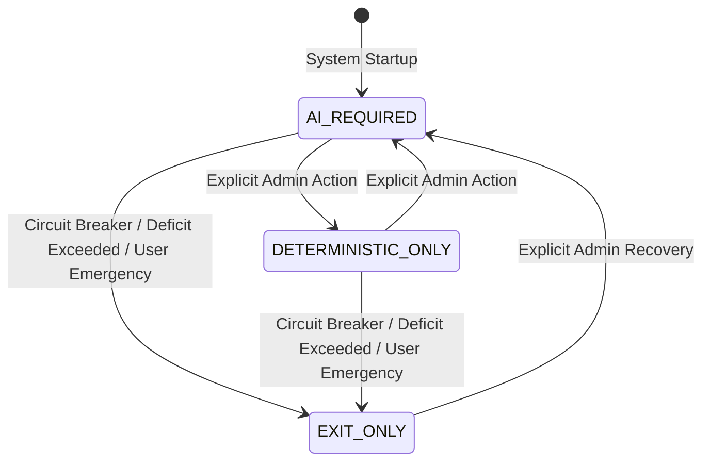

# Fail-Closed Decision Policy & Safety Invariants

**Classification**: Quantitative Risk Standard / Policy Specification  
**Target Systems**: Seven-Stage Pipeline, AI Council, Execution Lifecycle, Risk Governor (`Bot-Tradding-AI`)  
**Scope**: Trade Candidate Ingestion, Multi-Agent Consensus, Data Freshness, Circuit Breakers

---

## 1. Fundamental Principle: Asymmetric Risk Gating

In institutional trading systems, errors of omission (missing an opportunity) carry negligible cost compared to errors of commission (entering a trade during corrupted state, network partition, or partial system failure).

Therefore, this trading desk operates under a strict **Fail-Closed Policy**:
- **Risk-Increasing Operations** (`OPEN_LONG`, `OPEN_SHORT`, `INCREASE_LONG`, `INCREASE_SHORT`, `GRID_EXPAND`) require **100% verified consensus and data validity**. Any failure, timeout, schema corruption, or agent abstention triggers an immediate `VETO` / `NO_TRADE`.
- **Risk-Reducing Operations** (`REDUCE`, `EXIT`, `CLOSE_ALL`, `EMERGENCY_CLOSE`, `STOP_LOSS`, `TAKE_PROFIT`) **NEVER depend on AI or external inference**. They execute unconditionally via deterministic risk rules.

---

## 2. Formal Decision Modes

The system operates under three explicit, mutually exclusive decision modes:



### 2.1 `AI_REQUIRED` (Default Mode)
- Every new position entry or size increase must pass through all 7 pipeline stages.
- Stage 3 (AI Council) requires unanimous or qualified quorum with zero abstentions and zero errors.
- If 9Router or any constituent LLM agent is unreachable, the candidate order is rejected with `VETO` (`AI_UNAVAILABLE_FAIL_CLOSED`).
- **Silent fallback to deterministic entry is strictly prohibited**.

### 2.2 `DETERMINISTIC_ONLY` (Admin Override)
- Used during scheduled AI maintenance or offline quantitative research.
- Explicitly toggled by an `ADMIN` role with an audit log event.
- Stage 3 (AI Council) is bypassed cleanly; entry is governed strictly by Carver target position, Jesse regime filters, and Vibe Alpha momentum score.
- The pipeline status badge prominently displays `DETERMINISTIC_ONLY`.

### 2.3 `EXIT_ONLY` (Emergency / Risk Lockdown)
- Triggered automatically when:
  - Daily drawdown limit is breached (-3.0%).
  - Monthly drawdown limit is breached (-6.0%).
  - Startup inventory reconciliation fails.
  - L2 order book exhibits sustained crossed spread or toxic flow (VPIN > 0.85).
  - Operator triggers Emergency Stop.
- **Invariants**:
  - All new entry intents are unconditionally rejected.
  - Only position reductions, bracket exits, and liquidations are allowed.

---

## 3. Fail-Closed Gating Conditions (Risk-Increasing Intents)

A candidate order attempting to open or expand risk MUST fail-closed if any of the following conditions are met:

| Check Layer | Failure Condition | Pipeline Verdict | Action |
| :--- | :--- | :--- | :--- |
| **Market Data** | Snapshot age > 3.0s, L2 crossed book, missing klines, or future candle timestamps | `VETO` (`STALE_OR_INVALID_SNAPSHOT`) | Order Dropped |
| **Data Freshness** | `last_closed_at < now - timeframe - allowed_delay` (fixed single-evaluation math) | `VETO` (`DATA_FRESHNESS_BREACH`) | Order Dropped |
| **9Router Connectivity** | HTTP connection refused, timeout (>12s), or HTTP 429 rate limit | `VETO` (`9ROUTER_UNAVAILABLE`) | Order Dropped |
| **AI Agent Response** | Any of the 4 agents returns non-JSON, invalid schema, or missing model ID | `VETO` (`SCHEMA_VALIDATION_ERROR`) | Order Dropped |
| **AI Consensus** | Any agent returns `ABSTAIN` or `UNKNOWN`, or Risk Auditor votes `REJECT` | `VETO` (`AI_CONSENSUS_REJECTED`) | Order Dropped |
| **Execution State** | Unreconciled exchange inventory or active `execution_blocker` string | `VETO` (`EXECUTION_BLOCKER_ACTIVE`) | Order Dropped |

---

## 4. Elimination of Optimistic Defaults

### 4.1 Strict Status & Expectancy Enums
- The previous practice of defaulting to `SAFE`, `APPROVE`, `BUY`, or positive score in catch blocks is completely removed.
- Permitted uninitialized or error states are strictly:
  - `UNKNOWN`
  - `UNAVAILABLE`
  - `INSUFFICIENT_DATA`
  - `NOT_EVALUATED`

### 4.2 Structured Evidence Requirement
Unstructured text strings (e.g. `thought_process: "looks good"`) are replaced with a typed `AgentEvidence` schema:
```json
{
  "verdict": "APPROVE",
  "confidence": 0.85,
  "evidence_for": ["Strong 15m breakout", "Order book bid imbalance +0.65"],
  "evidence_against": ["Funding rate slightly elevated (+0.015%)"],
  "uncertainties": ["Impending CPI release in 45m"],
  "invalidating_conditions": ["Break below 61,200 invalidates long thesis"],
  "decision_summary": "High momentum confluence justifies 0.5x risk unit"
}
```
Any response lacking explicit evidence arrays fails schema validation and causes immediate fail-closed rejection.

---

## 5. Anti-Target-Chasing Invariant (Monthly Governor)

### 5.1 The Deficit Trap
In quantitative systems, attempting to "catch up" on monthly profit targets by increasing leverage or position sizing after a drawdown is mathematically equivalent to the Martingale fallacy and invariably leads to catastrophic liquidation.

### 5.2 Mandatory Mathematical Invariants
1. **Size Multiplier Ceiling**:
   $$\text{monthly\_size\_multiplier} \le 1.0 \quad \forall \text{ states}$$
2. **Deficit Leverage Cap**:
   $$\text{deficit\_mode\_leverage\_cap} \le \text{normal\_leverage\_cap}$$
3. **Recovery Sizing Rule**:
   When monthly PnL is in deficit (`DEFICIT_CONSERVATIVE` or `DEFICIT_CATCHUP`):
   - Multiplier is capped at `0.75x` to `1.0x` (never exceeding 1.0).
   - Maximum allowable leverage is clamped to `min(current_leverage, 3x)`.
   - Aggressive sizing bumps (e.g. `1.15x`) are permanently removed from the codebase.

---

## 6. Verification & Test Harness

Every safety invariant is verified by automated regression tests in `tests/test_fail_closed_policy.py`:
- [x] 9Router offline test $\rightarrow$ `NO_TRADE` fail-closed.
- [x] Agent abstention test $\rightarrow$ `VETO`.
- [x] Schema violation test $\rightarrow$ `VETO`.
- [x] Emergency exit with 9Router offline $\rightarrow$ `SUCCESS` (deterministic path).
- [x] Freshness double-call test $\rightarrow$ accurately detects stale data.
- [x] Monthly governor deficit test $\rightarrow$ multiplier never exceeds 1.0.
